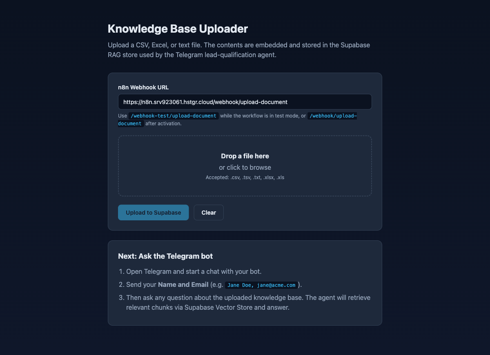

<div align="center">

# Lead Qualification Agent with RAG and Telegram

[](https://n8n.io)
[](https://supabase.com)
[](https://aistudio.google.com)
[](https://platform.openai.com)
[](https://core.telegram.org/bots)
[](LICENSE)

**Upload a knowledge base, then qualify leads through a Telegram chatbot that answers questions from it.**

[Setup Guide](SETUP.md) · [Architecture](#architecture) · [Web Tool](web/) · [n8n Workflow](Lead%20Qualification%20Agent%20with%20RAG%20and%20Telegram%20interface.json)

</div>

## Screenshot



## About

A lightweight, production-ready lead-generation pipeline composed of three pieces wired together by an n8n workflow:

1. A **static web uploader** (vanilla HTML/CSS/JS, no build step) that parses CSV / Excel / Text files in the browser and POSTs the extracted content to an n8n webhook.
2. An **n8n workflow** that embeds the content with OpenAI and stores it in a Supabase `pgvector` table — and in the same workflow, exposes a Telegram bot that answers user questions from the knowledge base while scoring each conversation as a lead from 0–100.
3. A **Supabase database** acting as the vector store for retrieval-augmented generation (RAG).

### Key features

| Feature | Detail |
|---|---|
| Browser-side file parsing | CSV / TSV / TXT via `FileReader`; XLS / XLSX via SheetJS (no server upload of raw files) |
| Vector RAG store | Supabase `pgvector` with the standard `documents` schema and IVFFlat cosine index |
| Two-stage agent | Stage 1 captures Name + Email; Stage 2 answers questions and scores intent (0–100) |
| Conversation memory | Per-user windowed memory (Simple Memory, keyed on Telegram user id) |
| High-score handoff | Configurable threshold (default 70+) triggers a Gmail notification to the sales team |
| Drop-in CORS-enabled webhook | Web tool can be served from any origin (e.g. GitHub Pages) |

## Tech Stack

| Layer | Technology |
|---|---|
| Frontend | Vanilla HTML5, CSS3, JavaScript (ES2020), [SheetJS](https://sheetjs.com/) for Excel parsing |
| Workflow Engine | [n8n](https://n8n.io) (self-hosted or cloud) |
| LLM | [Google Gemini](https://aistudio.google.com) (via the LangChain `lmChatGoogleGemini` node) |
| Embeddings | OpenAI `text-embedding-3-small` (1536-dim) |
| Vector Store | [Supabase](https://supabase.com) Postgres + [pgvector](https://github.com/pgvector/pgvector) |
| Chat Interface | Telegram Bot API |
| Notifications | Gmail (optional, OAuth2) |

## Architecture

```
                  ┌──────────────────────────┐
                  │   web/index.html         │
                  │   (static uploader)      │
                  └────────────┬─────────────┘
                               │  POST /webhook/upload-document
                               │  { filename, kind, content }
                               ▼
┌────────────────────────────────────────────────────────────────────┐
│                          n8n Workflow                              │
│                                                                    │
│   ─── Document Ingestion ──────────────────────────────────────    │
│   Upload Webhook → Supabase Vector Store (insert) → Respond        │
│                       ▲                                            │
│                       │  ai_embedding   ai_document                │
│            Embeddings OpenAI       Default Data Loader             │
│                                                                    │
│   ─── Telegram RAG Chat ───────────────────────────────────────    │
│   Telegram Trigger → AI Agent → Code (parse JSON) → If(score>69)   │
│                        ▲                                  │  ▲     │
│                  Chat / Memory / Tool                  true  false │
│                                                          │     │   │
│              OpenAI Chat / Simple Memory /            Gmail  Reply │
│              Supabase Vector Store (retrieve)                      │
└────────────────────────────────────────────────────────────────────┘
                               │
                               ▼
                  ┌──────────────────────────┐
                  │  Supabase Postgres       │
                  │  documents (pgvector)    │
                  └──────────────────────────┘
```

## Project Structure

```
n8n_leadgeneration/
├── README.md                                              # This file
├── SETUP.md                                               # Detailed step-by-step setup guide
├── CLAUDE.md                                              # Operational notes for Claude Code
├── Lead Qualification Agent with RAG and Telegram interface.json  # n8n workflow export
├── .claude/commands/leadgen-status.md                     # /leadgen-status diagnostic command
├── .mcp.json                                              # n8n + Supabase MCP servers
├── .env.example                                           # Template for required env vars
└── web/
    ├── index.html                                         # Uploader UI
    ├── style.css                                          # Styling
    ├── app.js                                             # File parsing + webhook POST
    └── mock_clients_1000.csv                              # 1000-row sample dataset
```

## Getting Started

For the full walkthrough — including signing up for Supabase / OpenAI / Telegram, creating the `documents` table, getting API keys, importing the workflow, and wiring credentials — see **[SETUP.md](SETUP.md)**.

### Quick start (assumes you've completed SETUP.md once)

**Prerequisites:**
- Python 3 (for serving the web tool)
- A running n8n instance (cloud or local) with the workflow imported and active
- Supabase project with the `documents` table created
- OpenAI API key, Telegram bot token, Supabase service-role key — all configured as n8n credentials

**Run the uploader:**

```bash
cd web
python3 -m http.server 8889
# open http://localhost:8889/
```

In the browser:
1. Confirm the **n8n Webhook URL** field matches your n8n instance.
2. Drag a CSV / Excel / TXT file onto the dropzone (or use the included `web/mock_clients_1000.csv`).
3. Click **Upload to Supabase**.

**Chat with the bot:**

1. Open Telegram and message your bot.
2. Send `Your Name, you@example.com` (one line, comma-separated).
3. Ask any question about the uploaded knowledge base.

## Deployment

### Web tool — GitHub Pages

The uploader is a static site and works on GitHub Pages out of the box. This repo includes a GitHub Actions workflow that publishes the `web/` folder to Pages on every push to `main`. After enabling Pages (Settings → Pages → Build from Actions), the tool is reachable at `https://<owner>.github.io/<repo>/`.

### Web tool — any static host

`web/` has zero build dependencies. Drop it into any static host: Vercel, Netlify, Cloudflare Pages, S3 + CloudFront.

### n8n workflow

Import [Lead Qualification Agent with RAG and Telegram interface.json](Lead%20Qualification%20Agent%20with%20RAG%20and%20Telegram%20interface.json) into your n8n instance via **Workflows → Import from File**, re-pick credentials on each node, and activate. Full instructions in [SETUP.md](SETUP.md#part-4--n8n).

## Configuration

Required environment variables (use [.env.example](.env.example) as a template — never commit `.env`):

| Variable | Purpose |
|---|---|
| `N8N_API_URL` | n8n API base URL (e.g. `http://localhost:5678/api/v1`) — used by MCP servers |
| `N8N_API_KEY` | n8n API key — used by MCP servers |
| `SUPABASE_ACCESS_TOKEN` | Supabase personal access token — used by MCP server |
| `NEXT_PUBLIC_SUPABASE_URL` | Project URL for reference |
| `TELEGRAM_BOT_TOKEN` | Bot token from BotFather (used by the diagnostic `/leadgen-status` command) |

The actual API keys consumed by the workflow (Google Gemini, OpenAI Embeddings, Telegram, Supabase service-role) are stored as **n8n credentials** inside the n8n instance — not in `.env` and not in this repo.

## Diagnostic command

A custom Claude Code command [/leadgen-status](.claude/commands/leadgen-status.md) is included for end-to-end health checks:

```
/leadgen-status
```

It pings the web tool, the n8n upload webhook, the Telegram bot's webhook registration, and the Supabase docs count, then surfaces a single verdict telling you which layer is broken.

## Security Notes

- The upload webhook is **unauthenticated** by default. For a public deployment, either tighten the webhook node's `allowedOrigins` to your specific origin, add an n8n auth header, or front the webhook with a reverse proxy that adds auth.
- The `service_role` Supabase key bypasses RLS — keep it inside the n8n credential store, never in client code.
- `.env` is gitignored. The repo's `.env.example` documents required variables without values.

## Contributing

1. Fork the repo
2. Create a feature branch (`git checkout -b feat/your-change`)
3. Commit with a conventional message (`feat:`, `fix:`, `docs:`, etc.)
4. Open a Pull Request

For larger changes, open an issue first to discuss the approach.

## Developed By

**Tertiary Infotech Academy Pte. Ltd.**

## Acknowledgements

- [n8n](https://n8n.io) — the workflow engine that ties everything together
- [Supabase](https://supabase.com) — Postgres + pgvector, with a clean management UI
- [LangChain n8n nodes](https://docs.n8n.io/advanced-ai/) — Vector Store, Embeddings, Agent, Memory
- [SheetJS](https://sheetjs.com/) — battle-tested in-browser Excel parsing
- [OpenAI](https://openai.com) — GPT-4o and the embedding API
- [Telegram Bot API](https://core.telegram.org/bots/api) — the chat front-end

## License

MIT — see [LICENSE](LICENSE) for details.

---

<div align="center">

If this project helped you, consider giving it a star.

</div>
